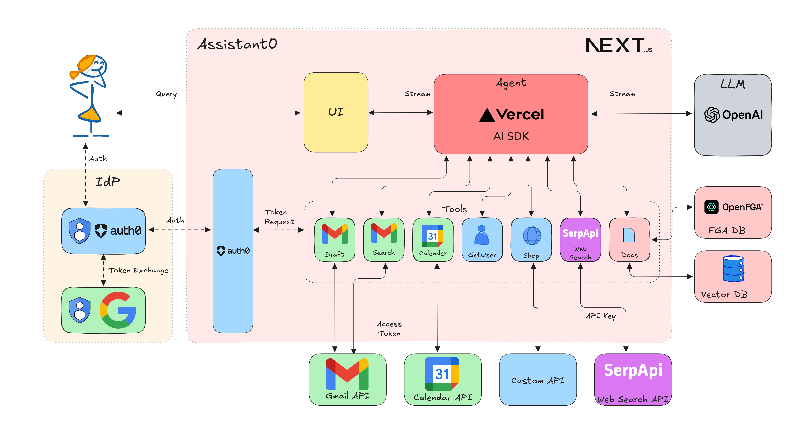

# Assistant0: An AI Personal Assistant Secured with Auth0 - Vercel AI Version

Assistant0 an AI personal assistant that consolidates your digital life by dynamically accessing multiple tools to help you stay organized and efficient.



## About the template

This template scaffolds an Auth0 + Next.js starter app. It mainly uses the following libraries:

- Vercel's [AI SDK](https://github.com/vercel-labs/ai) to handle the AI agent.
- The [Auth0 AI SDK](https://github.com/auth0/auth0-ai-js) and [Auth0 Next.js SDK](https://github.com/auth0/nextjs-auth0) to secure the application and call third-party APIs.
- [Auth0 FGA](https://auth0.com/fine-grained-authorization) to define fine-grained access control policies for your tools and RAG pipelines.
- Postgres with [Drizzle ORM](https://orm.drizzle.team/) and [pgvector](https://github.com/pgvector/pgvector) to store the documents and embeddings.

It's Vercel's free-tier friendly too! Check out the [bundle size stats below](#-bundle-size).

[](https://codespaces.new/auth0-samples/auth0-assistant0)
[](https://vercel.com/new/clone?repository-url=https%3A%2F%2Fgithub.com%2Fauth0-samples%2Fauth0-assistant0)

## 🚀 Getting Started

First, clone this repo and download it locally.

```bash
git clone https://github.com/auth0-samples/auth0-assistant0.git
cd auth0-assistant0/ts-vercel-ai
```

Next, you'll need to set up environment variables in your repo's `.env.local` file. Copy the `.env.example` file to `.env.local`.

- To start with the examples, you'll just need to add your NVIDIA NIM API key and Auth0 credentials for the Web app and Machine to Machine App.
  - You can set up a new Auth0 tenant with an Auth0 Web App and Token Vault following the Prerequisites instructions [here](https://auth0.com/ai/docs/get-started/call-others-apis-on-users-behalf).
  - Click on the tenant name on the [Quickstarts](https://auth0.com/ai/docs/call-your-apis-on-users-behalf), Go to the app settings (**Applications** -> **Applications** -> **WebApp Quickstart Client** -> **Settings** -> **Advanced Settings** -> **Grant Types**) and enable the CIBA grant and save.
  - For Async Authorizations, you can set up Guardian Push and Enroll the your user for Guardian following the Prerequisites instructions [here](https://auth0.com/ai/docs/async-authorization).
  - An Auth0 FGA account, you can create one [here](https://dashboard.fga.dev). Add the FGA store ID, client ID, client secret, and API URL to the `.env.local` file.
  - Optionally add a [SerpAPI](https://serpapi.com/) API key for using web search tool.

Next, install the required packages using your preferred package manager and initialize the database.

```bash
npm install # or bun install
# start the postgres database
docker compose up -d
# create the database schema
npm run db:migrate # or bun db:migrate
# initialize FGA store
npm run fga:init # or bun fga:init
```

## Offer Clearance With CIBA (Phone Approval)

Offer emails are gated by CIBA clearance in this project: `submit_offer_for_clearance` creates a CIBA request, and the email is only sent after `poll_offer_clearance` sees an approved status.

1. Configure CIBA on your Auth0 app
- In Auth0 Dashboard, open your app settings and enable the `Client Initiated Backchannel Authentication (CIBA)` grant type.
- Reference: [Configure Client-Initiated Backchannel Authentication](https://auth0.com/docs/get-started/applications/configure-client-initiated-backchannel-authentication).

2. Configure API audience + CIBA policy
- Set up/confirm the API audience used by the app (`AUTH0_CIBA_AUDIENCE`, or `SHOP_API_AUDIENCE` fallback).
- In the API CIBA settings/policy, allow the founder user(s) who can approve offers.

3. Enable phone approvals (Guardian push)
- Enable Auth0 Guardian push notifications.
- Enroll the founder user in Guardian on their phone.
- References:
  - [Mobile Push Notifications with CIBA](https://auth0.com/docs/get-started/authentication-and-authorization-flow/client-initiated-backchannel-authentication-flow/mobile-push-notifications-with-ciba)
  - [Enroll in push notifications](https://auth0.com/docs/secure/multi-factor-authentication/auth0-guardian#enroll-in-push-notifications)

4. Set required app environment variables
- `HEADHUNT_FOUNDER_USER_ID` (or `HEADHUNT_FOUNDER_USER_IDS`)
- `AUTH0_CIBA_AUDIENCE`
- `AUTH0_CIBA_SCOPE` (usually `openid`)
- Optional: `AUTH0_CIBA_LOGIN_HINT_ISSUER` if not `https://<AUTH0_DOMAIN>/`

5. Validate end-to-end behavior
- `submit_offer_for_clearance` should return `mode=awaiting_clearance` with a `cibaAuthReqId`.
- Approve on phone.
- `poll_offer_clearance` should return `mode=sent_after_clearance`.

Now you're ready to run the development server:

```bash
npm run dev  # or bun dev
```

Open [http://localhost:3000](http://localhost:3000) with your browser to see the result! Ask the bot something and you'll see a streamed response:


You can start editing the page by modifying `app/page.tsx`. The page auto-updates as you edit the file.

Backend logic lives in `app/api/chat/route.ts`. From here, you can change the prompt and model, or add other modules and logic.

## 📦 Bundle size

This package has [@next/bundle-analyzer](https://www.npmjs.com/package/@next/bundle-analyzer) set up by default - you can explore the bundle size interactively by running:

```bash
$ ANALYZE=true npm run build
```

## Supabase Automation Runtime

Automation orchestration now runs in Supabase Edge Functions so cron/webhook execution logs are visible in Supabase:

- `automation-cron`: enqueues watchdog runs and processes due queue runs.
- `automation-webhook`: maps DB/internal webhook events into queue runs.
- `automation-replay`: creates replay child runs.
- `agent-intercept`: ingress-style inbox intercept trigger.
- `agent-triage`: routing-focused intake trigger.
- `agent-analyst`: candidate scoring trigger.
- `agent-liaison`: interview scheduling request/reply trigger.
- `agent-dispatch`: offer draft/clearance trigger.

App routes under `/api/automation/*` are lightweight proxies to these Supabase functions.
Queue handler execution is called by Supabase via `/api/automation/execute`.

### Why 200 does not always mean flow success

`automation-cron` can return HTTP 200 even when downstream queue handlers fail and are retried/dead-lettered.
Always inspect `automation_runs` and `audit_logs` (or the cron response `processed` block) to confirm real progress.

### 1. Apply migrations

Run the project migration flow so helper SQL functions exist:

```bash
npm run db:migrate
```

### 2. Configure environment

Set these values in your app and Supabase function environment:

- `NEXT_PUBLIC_SUPABASE_URL`
- `SUPABASE_FUNCTIONS_URL`
- `SUPABASE_SERVICE_ROLE_KEY`
- `SUPABASE_AUTOMATION_FUNCTION_SECRET`
- `AUTOMATION_EXECUTE_URL`
- `AUTOMATION_EXECUTE_SECRET`
- `AUTOMATION_EXECUTE_TIMEOUT_MS` (optional, defaults to `12000`)
- `AUTOMATION_EXECUTE_COOKIE` (optional fallback cookie for headless cron runs that need Token Vault-backed tools)
- `AUTOMATION_AUTO_INTAKE_ENABLED` (optional, defaults to `true`)
- `AUTOMATION_INTAKE_QUERY` (optional Gmail query override for cron-driven intake scans)
- `HEADHUNT_FOUNDER_USER_ID` or `HEADHUNT_FOUNDER_USER_IDS`
- `AUTH0_CIBA_AUDIENCE` (or reuse `SHOP_API_AUDIENCE`)
- `AUTH0_CIBA_SCOPE` (optional override, defaults to `openid`)
- `AUTH0_CIBA_LOGIN_HINT_ISSUER` (optional override)

For the current edge flow, Token Vault-backed Gmail/Calendar/Cal tools require an authenticated cookie context.
Use one of these patterns:

- Preferred for manual/relay calls: send `x-automation-execute-cookie` header when calling `/api/automation/cron`.
- Headless cron fallback: set `AUTOMATION_EXECUTE_COOKIE` in function secrets.

### 3. Deploy Edge Functions

```bash
npx supabase login
npx supabase link --project-ref <your_project_ref>

# Set edge function secrets (repeat/update as needed)
npx supabase secrets set SUPABASE_AUTOMATION_FUNCTION_SECRET="<same-secret-used-by-app-proxy>"
npx supabase secrets set AUTOMATION_EXECUTE_URL="https://<your-app-domain>/api/automation/execute"
npx supabase secrets set AUTOMATION_EXECUTE_SECRET="<same-secret-used-by-execute-route>"
npx supabase secrets set AUTOMATION_EXECUTE_TIMEOUT_MS="12000"
npx supabase secrets set AUTOMATION_AUTO_INTAKE_ENABLED="true"
npx supabase secrets set AUTOMATION_INTAKE_QUERY="in:inbox newer_than:14d -category:promotions -category:social -subject:newsletter -subject:digest -subject:unsubscribe"

# Optional fallback if cron calls are headless and need Token Vault context
npx supabase secrets set AUTOMATION_EXECUTE_COOKIE="__session=<cookie-value>"

npx supabase functions deploy automation-cron
npx supabase functions deploy automation-webhook
npx supabase functions deploy automation-replay
npx supabase functions deploy agent-intercept
npx supabase functions deploy agent-triage
npx supabase functions deploy agent-analyst
npx supabase functions deploy agent-liaison
npx supabase functions deploy agent-dispatch
```

### 4. Wire Supabase cron and webhooks

- Cron target: `automation-cron` with body like `{"job":"all","limit":6}`.
- Database webhook target: `automation-webhook` with Supabase event payloads.
- Replay can be invoked manually via `automation-replay`.

For faster response paths, webhook and replay calls can process queue work immediately:

- `automation-webhook`: include `{"processNow":true,"processLimit":1}` to enqueue and execute in one call.
- `automation-replay`: defaults to immediate execution (`processNow=true`), override with `{"processNow":false}` to enqueue-only.

Agent facade endpoints (same auth header as other functions):

- `agent-intercept`: enqueue/process `intake.scan` runs tagged `agentName: intercept`.
- `agent-triage`: enqueue/process `intake.scan` runs tagged `agentName: triage`.
- `agent-analyst`: enqueue/process `candidate.score` runs tagged `agentName: analyst`.
- `agent-liaison`: enqueue/process `scheduling.request.send` or `scheduling.reply.parse_book` tagged `agentName: liaison`.
- `agent-dispatch`: enqueue/process `offer.draft.create` or `offer.clearance.poll` tagged `agentName: dispatch`.

`automation-cron`, `automation-webhook`, and follow-up chaining now include per-agent counters in `processed.agents` so UI layers can display "which agent is processing what".

Use the `Authorization: Bearer <SUPABASE_AUTOMATION_FUNCTION_SECRET>` header (or `x-automation-secret`) for all automation function calls.
When triggering cron via app proxy routes, `x-automation-execute-cookie` (or `cookie`) can be forwarded so downstream `/api/automation/execute` calls have an authenticated session.

### 5. Quick health checks

After deploy, run:

```bash
curl -X POST "https://<your-app-domain>/api/automation/cron" \
  -H "Authorization: Bearer <AUTOMATION_CRON_SECRET>" \
  -H "x-automation-secret: <AUTOMATION_CRON_SECRET>" \
  -H "Content-Type: application/json" \
  --data '{"job":"all","limit":6}'
```

Then verify queue progress in DB:

- `automation_runs`: confirm `intake.scan`, `candidate.score`, and `scheduling.reply.parse_book` are being inserted/executed.
- `audit_logs`: confirm intake and scheduling actions are being written.

### 6. Full Edge Flow Smoke Test

Use one command to validate the full automated path:

- ingest intercept
- candidate scoring
- scheduling request send/draft with Cal slots
- booking from candidate reply (Cal invitation link)
- offer draft generation

```bash
npm run smoke:edge-e2e
```

Default mode is request-first/non-strict: if no newer candidate reply exists yet, the script reports `waiting_for_candidate_reply` instead of forcing booking.
Use strict mode when you expect a fresh reply and full booking->offer draft chain in a single run:

```bash
npm run smoke:edge-e2e -- --strict
```

Useful overrides:

```bash
# Run in draft mode for scheduling request email
npm run smoke:edge-e2e -- --request-send-mode draft

# Use custom candidate/job ids and verbose output
npm run smoke:edge-e2e -- \
  --candidate-id <candidate_id> \
  --job-id <job_id> \
  --organization-id <org_id> \
  --verbose
```

Required env/secret inputs for the smoke script:

- `AUTOMATION_CRON_SECRET` (or `SUPABASE_AUTOMATION_FUNCTION_SECRET`)
- `SUPABASE_FUNCTIONS_URL` or `NEXT_PUBLIC_SUPABASE_URL`
- `SUPABASE_SERVICE_ROLE_KEY` to read `automation_runs` for stage-level assertions

Recommended edge secrets for liaison scheduling:

- `CAL_PUBLIC_USERNAME` (or `CAL_PUBLIC_TEAM_SLUG` / `CAL_PUBLIC_ORGANIZATION_SLUG`)
- `CAL_INTERVIEW_EVENT_TYPE_SLUG`

Offer stage note:

- `offer.draft.create` creates/updates an offer draft record and draft content.
- Sending the offer email is handled by `submit_offer_for_clearance` / clearance flow, not by draft creation alone.

## License

This project is open-sourced under the MIT License - see the [LICENSE](LICENSE) file for details.

## Author

This project is built by [Deepu K Sasidharan](https://github.com/deepu105).
